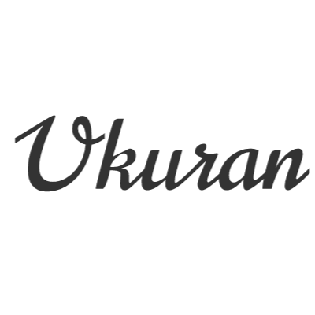

# Ukuran by Andre Sion

> This is a tool that'll probably be useful for designers.

## FAQ

#### What framework did you use?

- Static HTML
- A bit of CSS
- jQuery

_i was too lazy to setup the vue workspace so ended up going with a static html page_

#### Why is this tool so shitty?

I mean, you called it a _**tool**_, it can't be shitty.

#### Why is this thing so shitty?

Because I coded it late at night, I didn't create the first codebase at night, but the final result of the webpage was created and deployed late at night. So, yeah.

#### Why is your taste of humor so lame?

Because............. well to be honest, everybody thinks they're funny but only some are, so I always thought that I was funny. Turns out I weren't.

#### Is this project licensed?

Yes it is, it's licensed under the MIT license, go check the `license.md` if you would like to read it.